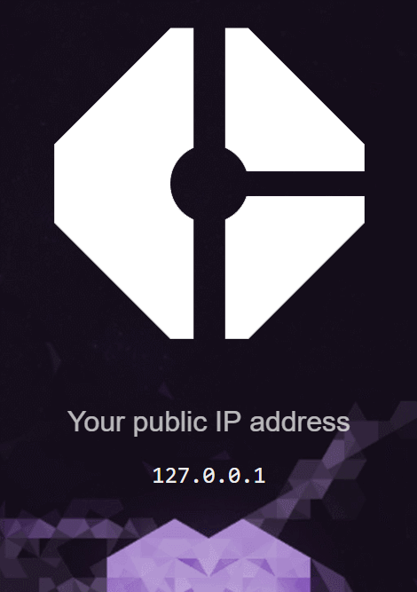

# flask-vuejs-simple
A very basic flask app with a vue-cli generated frontend



### Requirements

| software | version |
|----------|:-------:|
| nodejs   | 9.8.0   |
| python   | 3.6.4   |
| npm      | 5.7.1   |


### clone
```
λ git clone https://github.com/inveracity/flask-vuejs-simple
λ cd flask-vuejs-simple
```

### Install javascript dependencies
```
λ npm install
```

### Build
```
λ npm run build
```

### Install python requirements
```
λ pip install -r requirements.txt
```

### Run backend flask app in a separate terminal
```
λ python run.py
```

### Run frontend for handy autorefresh
```
λ npm run dev
```

# Things to note

Look at the config/index.js file, it does a proxy thing so that it's easier to make api requests to the flask app when running in dev mode.
